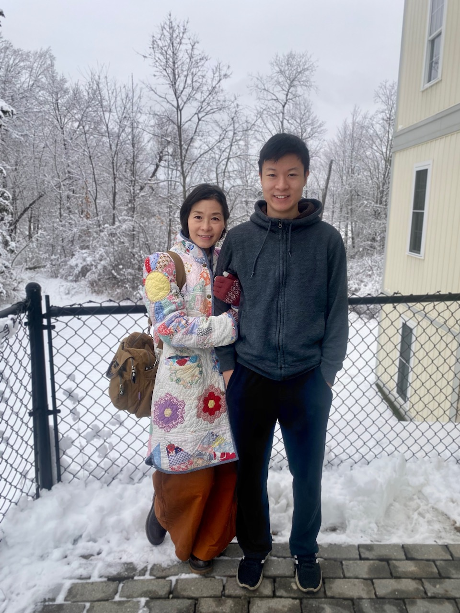

<!-- Hello, Website! -->

<!-- For more information about simple R Markdown websites, please read the documentation at https://bookdown.org/yihui/rmarkdown/rmarkdown-site.html. -->

<!-- Please also note that simple R Markdown sites are _not_ based on **blogdown**. They are probably good for websites with only a few Rmd documents. For larger-scale and more sophisticated websites (such as blogs), you may want to use **blogdown** instead: https://github.com/rstudio/blogdown. -->

what is up my dudes welcome to my website
       
real picture of me below

 
ok but fr
   
My name is Jett Chan, and I'm a second year undergrad Biology major at UNH. I lived my entire life before college in Massachusetts, and before I came to UNH, I did two years of computer engineering at Rochester Institute of Technology (I didn't like it that much, so I transferred here.)
   
   
Here is an actual picture of me (and my mom).

